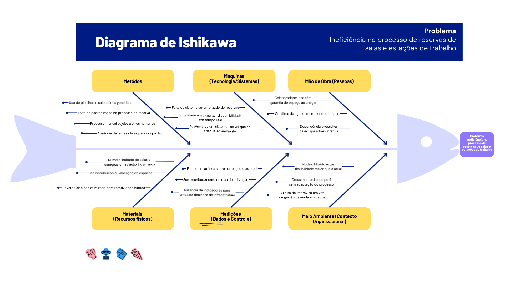

import { Card, CardGrid } from '@astrojs/starlight/components'

## Introdução ao Negócio e Contexto

A **Softex** (Associação para Promoção da Excelência do Software Brasileiro) é uma entidade sem fins lucrativos dedicada ao fortalecimento do setor de tecnologia e software no Brasil. Com mais de 25 anos de atuação, é reconhecida como a principal articuladora de programas estratégicos de tecnologia e inovação.

### Áreas de Atuação

<CardGrid>
  <Card title="Fomento ao Empreendedorismo" icon="star">
    **Startups e Inovação**
    
    - Apoio a empresas em estágio inicial
    - Programas de aceleração
    - Conexão com investidores
  </Card>
  
  <Card title="Capacitação e Certificação" icon="book">
    **Desenvolvimento de Talentos**
    
    - Certificação de profissionais
    - Programas de capacitação
    - Formação especializada em TI
  </Card>
  
  <Card title="Internacionalização" icon="globe">
    **Expansão Global**
    
    - Apoio à exportação
    - Conexões internacionais
    - Mercados externos
  </Card>
  
  <Card title="Transformação Digital" icon="laptop">
    **Modernização Setorial**
    
    - Digitalização de processos
    - Adoção de tecnologias
    - Inovação empresarial
  </Card>
</CardGrid>

### Modelo de Trabalho Híbrido

A Softex opera em **modelo híbrido**, combinando atividades presenciais e remotas, o que exige:

- **Coordenação eficiente** de recursos físicos
- **Gestão de salas de reunião** para alinhamentos e videoconferências
- **Controle de estações de trabalho** não fixas (coworking interno)
- **Integração** com Google Workspace e Slack
- **Compliance** com políticas internas e governança

## Identificação da Oportunidade

### Problema Atual

<CardGrid>
  <Card title="Gestão Manual" icon="file">
    **Processo Fragmentado**
    
    - Planilhas desatualizadas
    - Calendários não integrados
    - Comunicação por mensagens
  </Card>
  
  <Card title="Conflitos de Reserva" icon="alert">
    **Duplicação de Agendamentos**
    
    - Reservas simultâneas
    - Falta de sincronização
    - Retrabalho administrativo
  </Card>
  
  <Card title="Baixa Visibilidade" icon="eye">
    **Ocupação Desconhecida**
    
    - Dados não centralizados
    - Dificuldade no planejamento
    - Decisões sem embasamento
  </Card>
</CardGrid>

### Análise de Causas

### Oportunidade de Solução

<CardGrid>
  <Card title="Gestão Inteligente" icon="cpu">
    **Baseada em Dados**
    
    - Processo centralizado
    - Registros confiáveis
    - Rastreabilidade completa
  </Card>
  
  <Card title="Modelo Híbrido" icon="users">
    **Previsibilidade**
    
    - Reservas centralizadas
    - Fluidez no escritório
    - Redução de incertezas
  </Card>
  
  <Card title="Otimização" icon="trending-up">
    **Espaço Físico**
    
    - Dados operacionais
    - Indicadores gerenciais
    - Decisões embasadas
  </Card>
  
  <Card title="Produtividade" icon="lightning">
    **Eficiência Interna**
    
    - Menos tempo manual
    - Automação de processos
    - Foco em atividades-fim
  </Card>
</CardGrid>

## Desafios do Projeto

### Desafios Técnicos

<CardGrid>
  <Card title="Integração" icon="link">
    **Sistema Centralizado**
    
    - Tempo real
    - Evitar duplicidade
    - Performance otimizada
  </Card>
  
  <Card title="Compatibilidade" icon="shield">
    **Sistemas Existentes**
    
    - Não comprometer infraestrutura
    - Integração suave
    - Manutenção simplificada
  </Card>
</CardGrid>

### Desafios de Adoção

<CardGrid>
  <Card title="Mudança Cultural" icon="refresh">
    **Adaptação Digital**
    
    - Treinamento da equipe
    - Suporte contínuo
    - Gradual implementação
  </Card>
  
  <Card title="Familiarização" icon="book">
    **Capacitação**
    
    - Ferramentas de automação
    - Processos digitais
    - Boas práticas
  </Card>
</CardGrid>

## Segmentação de Clientes

### Público-Alvo Interno

<CardGrid>
  <Card title="Colaboradores Híbridos" icon="user">
    **Usuários Finais**
    
    - Previsibilidade de reservas
    - Praticidade no agendamento
    - Clareza de disponibilidade
  </Card>
  
  <Card title="Gestores e Líderes" icon="users">
    **Coordenadores de Equipe**
    
    - Organização de encontros
    - Coordenação de agendas
    - Otimização de tempo
  </Card>
  
  <Card title="Áreas Administrativas" icon="settings">
    **Governança do Espaço**
    
    - Padronização de regras
    - Fiscalização de uso
    - Redução de carga operacional
  </Card>
  
  <Card title="Alta Gestão" icon="chart">
    **Visão Estratégica**
    
    - Indicadores de ocupação
    - Dados para decisões
    - Otimização de custos
  </Card>
</CardGrid>

## Benefícios Esperados

- **Redução de conflitos** de reserva em 90%
- **Economia de tempo** administrativo de 60%
- **Visibilidade completa** da ocupação
- **Decisões baseadas** em dados reais
- **Integração** com ecossistema corporativo
- **Compliance** com políticas internas
