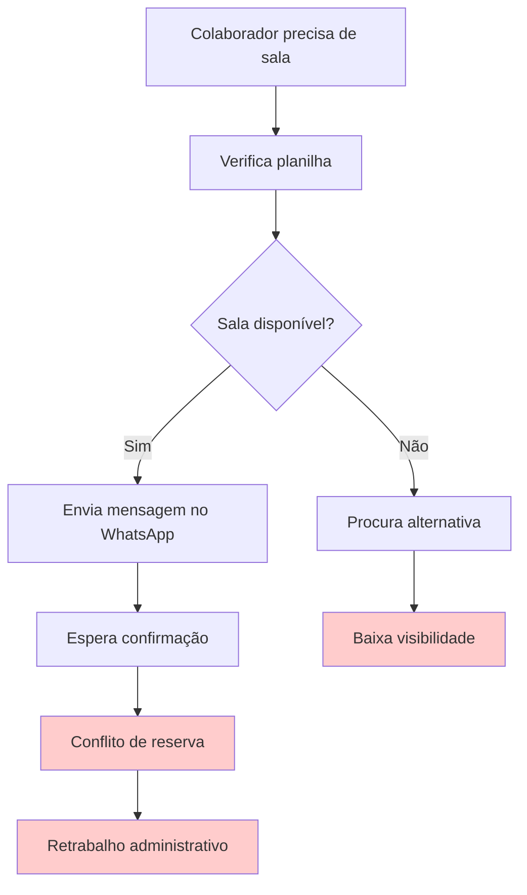

# Cenário Atual do Cliente e do Negócio

## 1.1 Introdução ao Negócio e Contexto

A **Softex** é uma entidade sem fins lucrativos com mais de 25 anos de atuação no fortalecimento do setor de tecnologia brasileiro. Atua em parceria com o MCTI e outras instituições, fomentando inovação, capacitação e competitividade no setor de TI.

A entidade opera por meio de uma **rede nacional de polos regionais** conectando diferentes atores do ecossistema de inovação, desde startups até grandes empresas.

No contexto interno, a Softex adota **modelo de trabalho híbrido** que exige coordenação eficiente de recursos físicos de escritório, especialmente salas de reunião e estações de trabalho. A demanda varia conforme calendário institucional e ciclos de projeto.

A organização possui diretrizes de governança, políticas de uso de espaços e integração ao ecossistema corporativo (Google Workspace e Slack) que orientam a gestão diária dos recursos físicos.

## 1.2 Identificação da Oportunidade ou Problema

### Enunciado do Problema

A Softex não possui um processo/sistema centralizado para gerir o uso dos recursos físicos do escritório (salas de reunião e estações de trabalho). O fluxo atual, **manual e fragmentado** (planilhas, calendários e trocas por mensagem), gera:

### Fluxo Atual (Problemático)

| Problema | Impacto |
|----------|---------|
| **Conflitos de reserva** | Duplicidade de agendamentos |
| **Retrabalho administrativo** | Tempo perdido em mediação manual |
| **Baixa visibilidade da ocupação** | Dificuldade no planejamento |
| **Dificuldade no planejamento do espaço híbrido** | Ineficiência operacional |

### Oportunidade (Justificativa para desenvolvimento interno)

| Oportunidade | Benefício |
|--------------|-----------|
| **Gestão Inteligente e Baseada em Dados** | Governança padronizada com registros confiáveis e rastreáveis |
| **Aderência ao Modelo Híbrido** | Processo centralizado com previsibilidade para colaboradores |
| **Otimização do Espaço Físico** | Dados operacionais para decisões de dimensionamento e layout |
| **Produtividade Interna** | Redução de tempo manual no agendamento e resolução de conflitos |
| **Conformidade e Políticas Internas** | Aderência às regras da Softex e integração corporativa |

## 1.3 Desafios do Projeto

| Desafio | Descrição |
|---------|-----------|
| **Técnico Principal** | Desenvolver sistema centralizado com reservas em tempo real sem comprometer sistemas internos |
| **Adoção** | Adaptação dos colaboradores ao novo processo digital com treinamentos necessários |

## 1.4 Segmentação de Clientes

O desafio de organizar reservas não é exclusivo da Softex. Diversas organizações em modelo híbrido enfrentam as mesmas dificuldades na gestão de espaços físicos.

### Dados de Mercado

A [Deskbee](https://www.deskbee.com/) atende 78 das 500 maiores empresas do Brasil e reúne ~400 mil usuários em 25+ países, demonstrando a crescente adesão às rotinas híbridas.

#### Referências de Pesquisa

A crescente adesão ao trabalho híbrido é evidenciada por diversas pesquisas:

- **Gartner Research** indica que 82% dos líderes empresariais planejam permitir trabalho híbrido ([gartner.com](https://www.gartner.com/))
- **McKinsey Global Institute** aponta que 20-25% da força de trabalho em economias avançadas pode trabalhar remotamente ([mckinsey.com](https://www.mckinsey.com/))
- **Microsoft Work Trend Index** revela que 73% dos trabalhadores querem opções de trabalho flexíveis ([microsoft.com](https://www.microsoft.com/))
- **IBGE - PNAD Contínua** documenta o crescimento do trabalho remoto no Brasil pós-pandemia ([ibge.gov.br](https://www.ibge.gov.br/))

### Tamanho do Mercado

O mercado de gestão de espaços corporativos movimenta aproximadamente **US$ 4.2 bilhões** globalmente, com crescimento anual de 12.5%. O segmento de software de reservas representa **US$ 1.8 bilhões** e cresce 15.3% ao ano, enquanto soluções híbridas atingem **US$ 2.4 bilhões** com crescimento de 18.7%.

*Fonte: [MarketsandMarkets](https://www.marketsandmarkets.com/), [Grand View Research](https://www.grandviewresearch.com/)*

### Principais Concorrentes

O mercado apresenta diversos players estabelecidos:

- **[Skedda](https://www.skedda.com/)** (Austrália) - Especializada em reservas de salas e espaços
- **[Envoy](https://envoy.com/)** (EUA) - Solução completa de workplace management  
- **[Robin](https://robinpowered.com/)** (EUA) - Foco em desk and room booking
- **[OfficeSpace](https://www.officespace.com/)** (EUA) - Software de gestão de espaços corporativos

Estas soluções, embora robustas, apresentam limitações em integrações e custos que justificam o desenvolvimento de uma solução customizada para a Softex.

### Perfis Internos

O sistema atenderá diferentes perfis de usuários dentro da organização:

**Colaboradores em Regime Híbrido** precisam de previsibilidade e praticidade para reservar estações e salas nos dias de presença, com clareza de disponibilidade e adequação do espaço à atividade.

**Gestores e Líderes de Equipe** necessitam organizar encontros presenciais e coordenar agendas do time, evitando conflitos de agendamento e otimizando o tempo coletivo.

**Áreas Administrativas / Facilities** precisam padronizar e fiscalizar regras de uso (capacidade, janelas, limites, no-show), reduzir carga operacional de mediação manual e ter dados confiáveis para operação diária.

**Alta Gestão / Diretoria** precisa de indicadores de ocupação e no-show para embasar decisões sobre infraestrutura, custos e políticas de uso do espaço.
