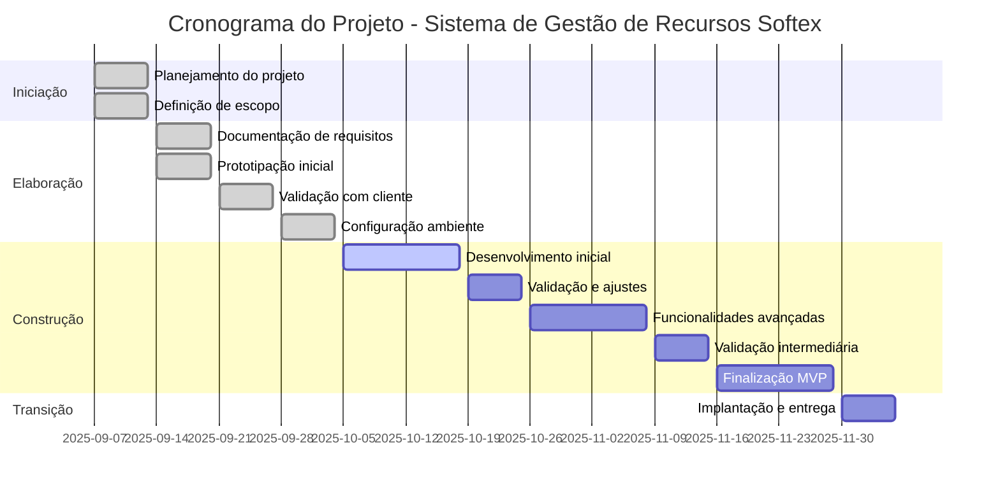

# Cronograma e Entregas

## Visão Geral

| Aspecto | Detalhes |
|---------|----------|
| **Duração Total** | 13 semanas (07/09/2025 a 09/12/2025) |
| **Metodologia** | Desenvolvimento incremental com sprints |
| **Entregas** | Quinzenais ao cliente |
| **Atualizações** | Semanais de progresso |
| **Fase Atual** | Iniciação (planejamento e definições) |

### Timeline do Projeto

## Fase de Iniciação (Semana 0)

| Semana | Período | Atividades | Entrega |
|--------|---------|------------|---------|
| **0** | 07/09 – 13/09 | • Definição do escopo do projeto • Identificação de stakeholders • Planejamento inicial • Definição de metodologia • Estabelecimento de cronograma base | • Termo de abertura do projeto • Plano de gerenciamento • Estrutura analítica do projeto |

## Fase de Elaboração (Semanas 1 a 3)

| Semana | Período | Atividades | Entrega |
|--------|---------|------------|---------|
| **1** | 14/09 – 20/09 | • Documentação de requisitos funcionais e não funcionais • Prototipação inicial • Backlog inicial | • Documento de requisitos • Protótipo de telas |
| **2** | 21/09 – 27/09 | • Apresentação e ajuste do protótipo com feedback do cliente • Organização do repositório GitHub | • Protótipo validado • Repositório estruturado |
| **3** | 28/09 – 04/10 | • Configuração inicial de front-end, back-end, banco de dados e Docker | • Ambiente de desenvolvimento pronto |

## Fase de Construção (Semanas 4 a 11)

| Semana | Período | Atividades | Entrega |
|--------|---------|------------|---------|
| **4-5** | 05/10 – 18/10 | • Desenvolvimento inicial (reservas básicas, cadastro de salas/usuários, banco conectado) | • Primeira versão funcional (reserva simples) |
| **6** | 19/10 – 25/10 | • Testes iniciais, ajustes de arquitetura • Mini demo | • Fluxo básico de reserva validado |
| **7-8** | 26/10 – 08/11 | • Desenvolvimento intermediário (mapa interativo, regras de uso/capacidade, integração inicial com Google Calendar e perfis) | • Versão intermediária com mapa interativo |
| **9** | 09/11 – 15/11 | • Testes de integração, correções • Mini demo com cliente | • Versão validada com mapa e reservas |
| **10-11** | 16/11 – 29/11 | • Funcionalidades finais para o MVP (relatórios, notificações Slack, ajustes UX) | • MVP completo |

## Fase de Transição (Semana 12 e Fechamento)

| Período | Atividades | Entrega |
|---------|------------|---------|
| **Semana 12** (30/11 – 06/12) | • Implantação no servidor • Testes finais • Capacitação da equipe | • Sistema implantado e validado |
| **Prazo Final** (09/12/2025) | • Projeto finalizado • Validado pelo cliente • Documentação publicada no GitPages | • Sistema implantado, validado e equipe treinada |

## Cronograma Detalhado por Sprint

### Sprint 0 (Semana 0)
**Objetivo:** Iniciação e Planejamento do Projeto

| Atividade | Responsável | Prazo |
|-----------|-------------|-------|
| Definição do escopo | Felipe, Yuri | Semana 0 |
| Identificação de stakeholders | Yuri | Semana 0 |
| Planejamento inicial | Felipe | Semana 0 |
| Definição de metodologia | Equipe | Semana 0 |
| Estabelecimento de cronograma | Felipe | Semana 0 |

### Sprint 1 (Semanas 1-2)
**Objetivo:** Planejamento e Prototipação

| Atividade | Responsável | Prazo |
|-----------|-------------|-------|
| Levantamento de requisitos | Felipe | Semana 1 |
| Prototipação de telas | Guilherme | Semana 1 |
| Validação com cliente | Yuri | Semana 2 |
| Estruturação do repositório | Yuri | Semana 2 |

### Sprint 2 (Semana 3)
**Objetivo:** Configuração do Ambiente

| Atividade | Responsável | Prazo |
|-----------|-------------|-------|
| Configuração do backend | Felipe, Pietro | Semana 3 |
| Configuração do frontend | Guilherme | Semana 3 |
| Configuração do banco | Júlia | Semana 3 |
| Configuração do Docker | Yuri, Kauã | Semana 3 |

### Sprint 3 (Semanas 4-5)
**Objetivo:** Desenvolvimento Inicial

| Atividade | Responsável | Prazo |
|-----------|-------------|-------|
| Modelagem do banco | Júlia, Pietro | Semana 4 |
| API de reservas básicas | Felipe, Pietro | Semana 4 |
| Interface de reservas | Guilherme | Semana 5 |
| Testes iniciais | Kauã | Semana 5 |

### Sprint 4 (Semana 6)
**Objetivo:** Validação e Ajustes

| Atividade | Responsável | Prazo |
|-----------|-------------|-------|
| Testes de integração | Kauã, Pietro | Semana 6 |
| Ajustes de arquitetura | Felipe, Pietro | Semana 6 |
| Demo com cliente | Yuri | Semana 6 |

### Sprint 5 (Semanas 7-8)
**Objetivo:** Funcionalidades Avançadas

| Atividade | Responsável | Prazo |
|-----------|-------------|-------|
| Mapa interativo | Guilherme | Semana 7 |
| Regras de uso/capacidade | Felipe | Semana 7 |
| Integração Google Calendar | Kauã | Semana 8 |
| Sistema de perfis | Pietro | Semana 8 |

### Sprint 6 (Semana 9)
**Objetivo:** Validação Intermediária

| Atividade | Responsável | Prazo |
|-----------|-------------|-------|
| Testes de integração | Kauã | Semana 9 |
| Correções e ajustes | Equipe | Semana 9 |
| Demo com cliente | Yuri | Semana 9 |

### Sprint 7 (Semanas 10-11)
**Objetivo:** Finalização do MVP

| Atividade | Responsável | Prazo |
|-----------|-------------|-------|
| Relatórios e indicadores | Júlia | Semana 10 |
| Notificações Slack | Kauã | Semana 10 |
| Ajustes de UX | Guilherme | Semana 11 |
| Testes finais | Kauã | Semana 11 |

### Sprint 8 (Semana 12)
**Objetivo:** Implantação e Entrega

| Atividade | Responsável | Prazo |
|-----------|-------------|-------|
| Deploy em produção | Yuri, Kauã | Semana 12 |
| Testes de aceitação | Kauã | Semana 12 |
| Treinamento da equipe | Yuri | Semana 12 |
| Documentação final | Equipe | Semana 12 |

## Marcos Importantes

| Marco | Semana | Status | Entregas |
|-------|--------|--------|----------|
| **1. Projeto Iniciado** | 0 | ✅ | • Termo de abertura aprovado • Escopo definido • Plano de gerenciamento estabelecido • Equipe alinhada |
| **2. Protótipo Validado** | 2 | ✅ | • Protótipo aprovado pelo cliente • Requisitos documentados • Repositório estruturado |
| **3. Ambiente Configurado** | 3 | ✅ | • Backend funcionando • Frontend conectado • Banco de dados configurado • Docker funcionando |
| **4. Primeira Versão Funcional** | 5 | ✅ | • Reservas básicas funcionando • Interface de usuário operacional • Testes iniciais passando |
| **5. Versão Intermediária** | 8 | ✅ | • Mapa interativo implementado • Regras de uso configuradas • Integrações básicas funcionando |
| **6. MVP Completo** | 11 | ✅ | • Todas as funcionalidades implementadas • Relatórios funcionando • Notificações ativas • Testes finais passando |
| **7. Sistema Implantado** | 12 | ✅ | • Deploy em produção • Equipe treinada • Documentação completa • Projeto finalizado |

## Riscos e Mitigações

### Riscos Identificados

| Risco | Probabilidade | Impacto | Mitigação |
|-------|---------------|---------|-----------|
| **Atraso no Mapa Interativo** | Média | Alto | Priorizar desenvolvimento desde o início, usar bibliotecas prontas |
| **Complexidade das Permissões** | Média | Alto | Simplificar modelo inicial, implementar versão básica primeiro |
| **Problemas de Integração** | Baixa | Médio | Testar integrações cedo, ter planos alternativos |
| **Atraso na Equipe** | Baixa | Alto | Distribuir responsabilidades, ter membros de backup |

### Plano de Contingência

| Ação | Descrição |
|------|-----------|
| **1. Priorizar** | Funcionalidades essenciais |
| **2. Simplificar** | Funcionalidades complexas |
| **3. Estender** | Prazo se necessário (com aprovação) |
| **4. Reduzir** | Escopo se crítico |

## Métricas de Acompanhamento

### Métricas de Progresso

| Métrica | Descrição |
|---------|-----------|
| **Funcionalidades** | Implementadas vs. planejadas |
| **Testes** | Passando vs. total de testes |
| **Bugs** | Encontrados vs. corrigidos |
| **Tempo** | Gasto vs. estimado |

### Métricas de Qualidade

| Métrica | Meta |
|---------|------|
| **Cobertura de testes** | >80% |
| **Bugs por funcionalidade** | <5 |
| **Tempo de resposta** | <2s |
| **Satisfação do cliente** | >8/10 |

## Comunicação e Relatórios

| Tipo | Frequência | Conteúdo |
|------|------------|----------|
| **Semanais** | Semanal | • Status das atividades • Bloqueios identificados • Próximos passos • Riscos e mitigações |
| **Quinzenais (Sprints)** | A cada 2 semanas | • Funcionalidades entregues • Demonstração para o cliente • Feedback recebido • Ajustes no planejamento |
| **Marco** | A cada marco | • Resumo do progresso • Lições aprendidas • Ajustes no cronograma • Próximas prioridades |
