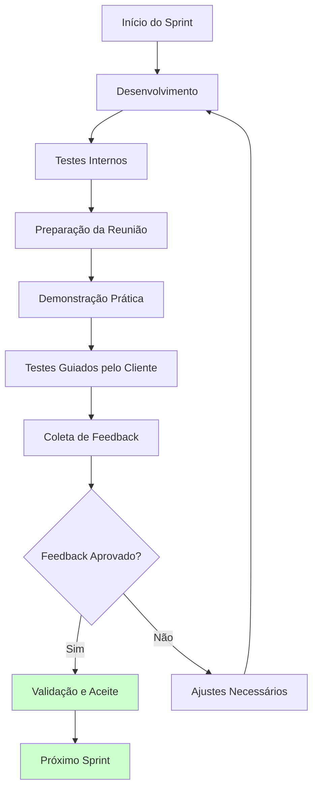

# Interação entre Equipe e Cliente

## 5.1 Equipe e Papéis

### Estrutura da Equipe

| Papel | Responsável Principal | Apoio | Responsabilidades |
|-------|----------------------|-------|-------------------|
| **Gerência do Projeto** | Yuri | - | Coordenação geral, prazos, priorização e interface com o cliente |
| **Front-End Web (Vue)** | Guilherme | Qualquer membro | Liderança técnica do Frontend |
| **Back-End (Python/DRF)** | Felipe e Pietro | Yuri, Kauã | Arquitetura, integrações, infraestrutura e rotinas de serviço |
| **DevOps / Infra & Deploy** | Yuri | Kauã | VMs, Docker, pipelines de CI/CD |
| **Modelagem de Dados** | Júlia | Pietro | Schema, migrações, consultas e performance |
| **Analista de Requisitos (BA)** | Felipe | Yuri, Kauã | Levantamento, validação e documentação |
| **Qualidade (QA)** | Kauã | Pietro | Testes funcionais/integrados e critérios de aceite |

## 5.2 Comunicação

### Ferramentas de Comunicação

| Ferramenta | Uso Principal | Características |
|------------|---------------|-----------------|
| **WhatsApp** | Comunicação rápida entre membros | • Alinhamentos rápidos • Resolução de dúvidas imediatas • Coordenação de atividades |
| **Discord** | Reuniões internas e encontros em aula | • Reuniões internas semanais • Encontros em aula • Compartilhamento de tela • Comunicação por voz |
| **Slack** | Comunicação direta com o cliente | • Comunicação com o cliente • Registro de decisões • Dúvidas e esclarecimentos • Acompanhamento de status |
| **Google Meet** | Reuniões quinzenais com cliente | • Reuniões formais com cliente • Apresentação de entregas • Validação de funcionalidades • Planejamento de próximos passos |
| **GitHub** | Gerenciamento do projeto | • Controle de versão do código • Gerenciamento de issues • Pull requests e code review • Acompanhamento de progresso |
| **GitPages** | Documentação e entregas | • Documentação do projeto • Relatórios de progresso • Entregas documentais • Acesso público ao projeto |

### Métodos e Frequência de Reuniões

| Tipo de Reunião | Frequência | Ferramenta | Participantes | Duração | Objetivo |
|------------------|------------|------------|---------------|---------|----------|
| **Interna Semanal** | Segundas-feiras | Discord | Equipe completa | 1-2h | Planejamento e acompanhamento do status da equipe |
| **Encontros em Aula** | Terças e quintas | Discord ou presencial | Equipe completa | 1h | Tirar bloqueios e revisar entregas |
| **Revisão e Validação** | A cada 2 semanas | Google Meet | Equipe + Cliente | 2-3h | Apresentação das funcionalidades concluídas, testes guiados e coleta de feedback |
| **Planejamento de Sprint** | Logo após as revisões | Discord | Equipe completa | 1-2h | Definir prioridades da próxima entrega com base no feedback do cliente |
| **Retrospectiva** | Ao final de cada sprint | Discord | Equipe completa | 1h | Discutir pontos fortes, aspectos a melhorar e lições aprendidas |

### Frequência de Interações com o Cliente

| Tipo de Interação | Frequência | Descrição |
|-------------------|------------|-----------|
| **Revisões Quinzenais** | A cada 2 semanas | Validação incremental do projeto ao final de cada sprint |
| **Interações Slack** | Conforme necessário | Discussões rápidas e ajustes ao longo do desenvolvimento |

### Agenda Típica das Revisões Quinzenais

| Etapa | Responsável | Atividade |
|-------|-------------|-----------|
| **1** | Equipe técnica | Apresentação das funcionalidades desenvolvidas |
| **2** | Equipe técnica | Demonstração prática do sistema |
| **3** | Cliente (com apoio da equipe) | Testes guiados pelo cliente |
| **4** | Gerente do Projeto | Coleta de feedback |
| **5** | Equipe + Cliente | Definição de prioridades para próximo sprint |

### Tipos de Interação pelo Slack

| Tipo | Descrição |
|------|-----------|
| **Dúvidas técnicas** | Esclarecimentos sobre implementação |
| **Esclarecimentos de requisitos** | Validação de especificações |
| **Ajustes de prioridades** | Mudanças no planejamento |
| **Status de desenvolvimento** | Acompanhamento do progresso |

## 5.3 Processo de Validação

### Validação Quinzenal

O processo de validação será realizado de forma quinzenal, acompanhando o fechamento de duas sprints, sempre com a entrega contínua de funcionalidades para o cliente.

### Fluxo de Validação

### Fluxo de Validação

| Etapa | Responsável | Atividades |
|-------|-------------|------------|
| **1. Preparação da Reunião** | Yuri (Gerente do Projeto) | • Preparar demonstração das funcionalidades • Organizar agenda da reunião • Enviar convite com antecedência • Preparar materiais de apoio |
| **2. Demonstração Prática** | Equipe técnica | • Apresentar funcionalidades desenvolvidas • Demonstrar uso prático do sistema • Explicar melhorias implementadas • Mostrar relatórios e indicadores |
| **3. Testes Guiados** | Cliente (com apoio da equipe) | • Cliente testa as funcionalidades • Equipe observa e anota feedback • Identificação de problemas ou melhorias • Validação de requisitos |
| **4. Coleta de Feedback** | Yuri (Gerente do Projeto) | • Registrar feedback do cliente • Identificar mudanças necessárias • Priorizar ajustes • Documentar decisões |
| **5. Validação e Aceite** | Cliente | • Aprovar funcionalidades apresentadas • Solicitar ajustes se necessário • Definir prioridades para próximo sprint • Confirmar cronograma |

### Situações Excepcionais

| Situação | Descrição |
|----------|-----------|
| **Mudanças críticas de requisitos** | Alterações que impactam o escopo do projeto |
| **Problemas técnicos significativos** | Bloqueios que impedem o desenvolvimento |
| **Necessidade de esclarecimentos urgentes** | Dúvidas que precisam ser resolvidas rapidamente |
| **Ajustes de cronograma** | Mudanças nos prazos ou entregas |

### Documentação das Validações

| Tipo | Ferramenta | Conteúdo |
|------|------------|----------|
| **Registro de Feedback** | Slack + Documento compartilhado | • Feedback recebido • Ações definidas • Responsáveis • Prazos |
| **Ata de Reunião** | Google Docs | • Participantes • Funcionalidades apresentadas • Decisões tomadas • Próximos passos |
| **Atualização do Backlog** | GitHub Projects | • Novas tarefas identificadas • Priorização atualizada • Estimativas de esforço • Dependências |

## 5.4 Gestão de Expectativas

| Aspecto | Ações |
|---------|-------|
| **Comunicação Transparente** | • Manter cliente informado sobre progresso • Comunicar problemas e atrasos prontamente • Explicar decisões técnicas de forma clara • Documentar todas as decisões importantes |
| **Alinhamento de Expectativas** | • Validar entendimento dos requisitos • Confirmar prioridades regularmente • Ajustar cronograma quando necessário • Gerenciar mudanças de escopo |
| **Qualidade das Entregas** | • Garantir que funcionalidades atendam aos requisitos • Realizar testes antes das apresentações • Preparar demonstrações bem estruturadas • Coletar feedback de forma organizada |

## 5.5 Resolução de Conflitos

### Identificação de Conflitos

| Tipo de Conflito | Descrição |
|------------------|-----------|
| **Interpretações de requisitos** | Diferentes entendimentos sobre especificações |
| **Prioridades conflitantes** | Disputas sobre o que deve ser priorizado |
| **Limitações técnicas** | Restrições não previstas no planejamento |
| **Mudanças de escopo** | Alterações que impactam o projeto |

### Processo de Resolução

| Etapa | Ação |
|-------|------|
| **1** | Identificar o conflito claramente |
| **2** | Comunicar com todas as partes envolvidas |
| **3** | Analisar alternativas e impactos |
| **4** | Propor soluções viáveis |
| **5** | Decidir em conjunto com o cliente |
| **6** | Documentar a decisão tomada |

### Escalação

| Nível | Ação |
|-------|------|
| **1** | Escalar para o gerente do projeto (Yuri) |
| **2** | Se necessário, envolver o cliente |
| **3** | Buscar orientação do professor da disciplina |
| **4** | Documentar todo o processo |
