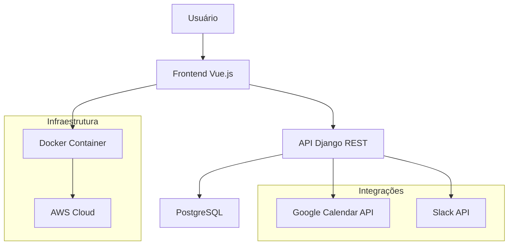

# Introdução

## Visão Geral do Projeto

Projeto da disciplina **REQ-T1** (Engenharia de Software - 2025.2) em parceria com a **Softex** para desenvolvimento de um sistema centralizado de gestão de recursos físicos.

## Objetivo Principal

Desenvolver um **sistema centralizado de gestão de recursos físicos** (salas de reunião e estações de trabalho) para a Softex, eliminando o processo manual e fragmentado atual.

## Contexto do Negócio

A Softex é uma entidade sem fins lucrativos com mais de 25 anos de atuação no setor de tecnologia brasileiro, operando em modelo de trabalho híbrido que exige coordenação eficiente de recursos físicos.

### Problema Identificado

A Softex não possui um processo/sistema centralizado para gerir recursos físicos. O fluxo atual, manual e fragmentado, gera conflitos de reserva, retrabalho administrativo e baixa visibilidade da ocupação.

## Solução Proposta

Sistema web com reservas online, mapa interativo de ocupação, gestão de capacidade, relatórios e integração corporativa (Google Calendar + Slack).

### Arquitetura do Sistema

## Tecnologias Utilizadas

| Categoria | Tecnologia | Descrição |
|-----------|------------|-----------|
| **Frontend** | Vue.js | Framework moderno e reativo para interface do usuário |
| **Backend** | Python + Django REST Framework | API robusta e escalável |
| **Backend** | PostgreSQL | Banco de dados relacional confiável |
| **Infraestrutura** | Docker | Containerização para deploy padronizado |
| **Infraestrutura** | GitHub | Controle de versão e colaboração |
| **Infraestrutura** | AWS | Hospedagem em nuvem |
| **Integrações** | Google Calendar | Sincronização de reservas |
| **Integrações** | Slack | Notificações automáticas |
| **Integrações** | Google Workspace SSO | Autenticação integrada |

## Metodologia de Desenvolvimento

| Aspecto | Detalhes |
|---------|----------|
| **Processo** | Agile Unified Process (AUP) |
| **Ciclo de Vida** | Iterativo/Incremental |
| **Duração** | 12 semanas (14/09/2025 a 09/12/2025) |
| **Entregas** | Quinzenais com validação do cliente |

## Estrutura da Documentação

| Seção | Descrição |
|-------|-----------|
| **Cenário Atual** | Contexto do cliente e identificação do problema |
| **Solução Proposta** | Características e tecnologias da solução |
| **Estratégias de Engenharia** | Metodologia e processo de desenvolvimento |
| **Cronograma** | Planejamento e entregas do projeto |
| **Interação Equipe-Cliente** | Comunicação e validação |
| **Lições Aprendidas** | Reflexões e melhorias do processo |

## Equipe do Projeto

  

    
    

      <h3>Yuri Andrade</h3>
      
Gerência do Projeto & DevOps

      <a href="https://github.com/y123yuri" class="team-github">@y123yuri</a>
    

  

  

    
    

      <h3>Guilherme Gusmão</h3>
      
Frontend (Vue.js)

      <a href="https://github.com/gusmoles" class="team-github">@gusmoles</a>
    

  

  

    
    

      <h3>Felipe Pedroza</h3>
      
Backend (Python/DRF) & Análise de Requisitos

      <a href="https://github.com/darkymeubem" class="team-github">@darkymeubem</a>
    

  

  

    
    

      <h3>Júlia Santana</h3>
      
Modelagem de Dados

      <a href="https://github.com/camposs04" class="team-github">@camposs04</a>
    

  

  

    
    

      <h3>Pietro Calegari</h3>
      
Backend (Python/DRF)

      <a href="https://github.com/Pietrocv" class="team-github">@Pietrocv</a>
    

  

  

    
    

      <h3>Kauã Richard</h3>
      
DevOps/Infraestrutura & Qualidade (QA)

      <a href="https://github.com/rich4rd1" class="team-github">@rich4rd1</a>
    

  

