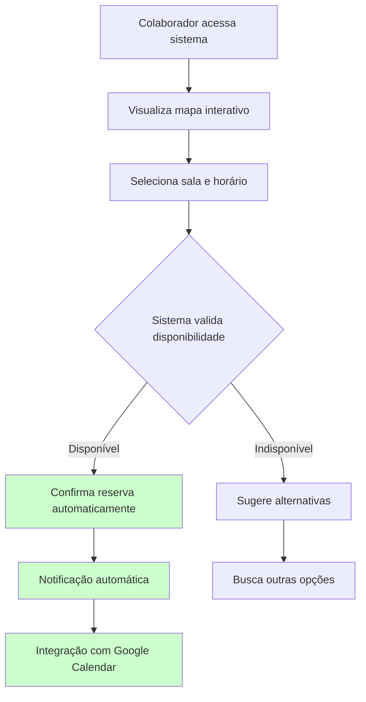

# Solução Proposta

## 2.1 Objetivo do Produto

Eliminar as ineficiências do processo atual (manual e suscetível a conflitos), garantindo maior fluidez na organização do espaço físico e no modelo de trabalho híbrido, além de gerar relatórios estratégicos.

### Resultados Esperados

| Resultado | Benefício |
|-----------|-----------|
| **Otimização da Utilização do Espaço** | Previsibilidade e redução de conflitos no uso de salas e estações |
| **Aumento da Produtividade Interna** | Redução do tempo em tarefas administrativas |
| **Autonomia dos Colaboradores** | Processo centralizado e acessível sem intermediários |
| **Visibilidade Estratégica** | Dados consistentes para decisões sobre infraestrutura e custos |
| **Apoio ao Modelo Híbrido** | Experiência presencial mais organizada e eficiente |

## 2.2 Características da Solução

Sistema focado no apoio à organização e planejamento do modelo híbrido, garantindo o uso eficiente das salas e ambientes de trabalho.

### Fluxo Proposto (Otimizado)

### Funcionalidades Principais

| Funcionalidade | Características |
|----------------|-----------------|
| **Reserva de Salas** | Reservas online simples e rápidas com prevenção automática de conflitos |
| **Mapa Interativo de Ocupação** | Visualização em tempo real de salas disponíveis/ocupadas |
| **Gestão de Capacidade e Regras** | Limites por sala conforme políticas internas e normas de segurança |
| **Relatórios e Indicadores** | Métricas de frequência de uso, horários de pico e uso por equipe |
| **Controle de Permissões** | Perfis por cargo/setor/equipe com bloqueio ou prioridade específica |
| **Integração Corporativa** | Sincronização com Google Workspace e notificações via Slack |
| **Flexibilidade de Ambientes** | Funcionamento para coworking, salas de reunião e escritórios satélites |

## 2.3 Tecnologias a Serem Utilizadas

| Categoria | Tecnologia | Justificativa |
|-----------|------------|---------------|
| **Frontend** | Vue.js | Facilidade de uso, curva de aprendizado rápida e interface moderna |
| **Backend** | Python + Django REST Framework | Uso consolidado na Softex, facilidade na geração de relatórios |
| **Banco de Dados** | PostgreSQL | Solução consolidada na infraestrutura da empresa, confiabilidade |
| **Controle de Versão** | Git + GitHub | Versionamento de código com Issues e Projects |
| **Containerização** | Docker | Ambientes padronizados, redução de problemas de compatibilidade |
| **Integrações** | Google Calendar | Sincronização de reservas (bloqueios, atualizações e cancelamentos) |
| **Integrações** | Slack | Confirmações e lembretes de agendamento |
| **Integrações** | Google Workspace SSO | Autenticação segura e integrada |

## 2.4 Pesquisa de Mercado e Análise Competitiva

### Análise dos Concorrentes

| Concorrente | Principais Problemas |
|-------------|---------------------|
| **Skedda** | Relatórios pouco úteis; integrações limitadas; interface datada |
| **Envoy Workplace/Desks** | Edição de reservas incômoda; limitações em certos fluxos |
| **Robin** | Custo alto e add-ons caros; notificações inconsistentes; lentidão |
| **OfficeSpace** | Atualização não imediata; recursos faltando em comparação |
| **Eptura (Condeco/Engage)** | Integrações instáveis; funcionalidades limitadas; suporte fraco |
| **WorkInSync** | App lento/travando em pico; relatórios insuficientes |

### Problemas Transversais Identificados

| Problema | Impacto |
|----------|---------|
| **Integrações incompletas** | Dificuldade na sincronização com calendários/colaboração |
| **Analytics limitados** | Relatórios rasos ou presos a planos superiores |
| **UX deficiente** | Interface fraca para editar/cancelar (sem autosave) |
| **Custo elevado** | Funcionalidades relevantes em tiers altos |

## 2.5 Viabilidade da Solução

| Aspecto | Viabilidade | Riscos | Conclusão |
|---------|-------------|--------|-----------|
| **Técnica** | ✅ Alta | Mapa interativo, permissões granulares, responsividade | Viável com time full-stack |
| **Prazo** | ✅ Alta | Mapa interativo e permissões podem alongar cronograma | Viável com planejamento de sprints |
| **Financeira** | ✅ Muito Alta | Horas de desenvolvimento, manutenção evolutiva | Alto custo-benefício (economia R$ 10-20 mil/ano) |
| **Mercado** | ✅ Alta | Necessidade comprovada (58 posições + 6 salas) | Alinhada à demanda, potencial de expansão |
| **Sustentabilidade** | ✅ Alta | Stack suportada, código próprio, Docker + AWS | Sustentável e escalável |

### Conclusão Geral
A ferramenta é tecnicamente viável, financeiramente vantajosa e atende à demanda real da Softex. O maior desafio será o desenvolvimento do mapa interativo e sistema de permissões, mas com abordagem ágil e priorização correta, o projeto tem alto potencial de sucesso.

## 2.6 Impacto da Solução

| Área de Impacto | Benefício |
|-----------------|-----------|
| **Operacional** | Redução do tempo de agendamento, eliminação de conflitos e retrabalho |
| **Experiência do Colaborador** | Previsibilidade, autoatendimento e organização em minutos |
| **Visibilidade Gerencial** | Relatórios confiáveis para ajustes de política e layout |
| **Governança e Conformidade** | Regras uniformes com trilha de auditoria |
| **Integração Corporativa** | Sincronização com Google Calendar e Slack |
| **Produtividade** | Liberação de tempo e economia de R$ 10-20 mil/ano |
| **Escalabilidade** | Arquitetura por APIs e Docker para replicação |
